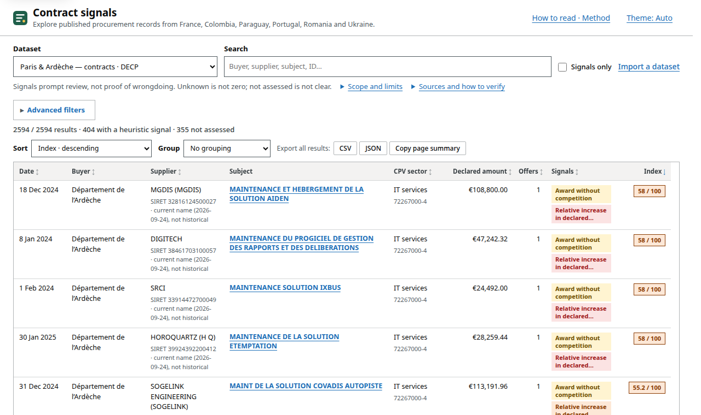

# Contract signals

**[Open the explorer](https://contracts.lasu.dev)** · [Methods](docs/score-v3.md) · [Data licences](docs/data-sources.md)

A static explorer for published public-procurement records from France, Chile, Colombia, Czechia, Paraguay, Portugal, Romania, Ukraine and the United Kingdom. It flags contract characteristics that may deserve a closer look, such as awards without competition, single offers, repeated awards to the same supplier, or long durations. Every row links to its source and shows which checks could or could not be evaluated.

**A signal prompts a review. It is not an accusation.** A zero or missing label does not mean a contract is clean, and “Not assessed” is never zero.

**Prototype:** not independently validated for operational procurement review. It does not make legal findings or automate procurement decisions.



*Illustrative view of a bounded French cohort—not a ranking of wrongdoing.*

## Use it

Open **[contracts.lasu.dev](https://contracts.lasu.dev)**, or run it locally from this folder:

```sh
python -m http.server 8000   # then open http://localhost:8000
```

You can also open `index.html` directly. If the browser blocks loading built-in data under `file://`, use the local import control for a JSON or CSV file.

- **English, Spanish or French:** pick a language in the header (or add `?lang=es` / `?lang=fr` to the link). Only the interface is translated; contract descriptions, justifications and names stay exactly as published.
- **Browser-local processing:** no application backend, account, cookies, analytics or uploads. Data is processed in your browser; the static host still receives ordinary requests and may process network metadata. Only your theme, advanced-filter preference and review marks are saved in local storage. Notes and their JSON exports are plaintext, not confidential case storage.
- **Filters:** advanced filters are closed by default; open them when needed. The choice is remembered in this browser, and the panel folds out on phones. The indicator list shows only the checks the loaded dataset runs, each with its count.
- **Record panel:** click a subject to open its panel: the record's own facts, its signals in one line each, context, sources, and a folded list of every check. Notes that apply to the whole dataset are under *Scope and limits*, not repeated per record. Step through results with *Previous*/*Next* or <kbd>j</kbd>/<kbd>k</kbd>; <kbd>/</kbd> jumps to search, <kbd>Esc</kbd> closes. *Print* gives a one-record case sheet with its sources and the link it came from.
- **Review marks:** mark a record *Follow up*, *Referred* or *Reviewed* and add a note. Marks never change the index, stay in this browser, and are not part of shared links; *Export notes* / *Import notes* move them between browsers or colleagues as a JSON file.
- **Share a view:** search, filters, sort, page, page size and the open record are kept in the link after `#`; copy the address to share it. Click a column heading to sort by it (click again to reverse); the Sort list also has sorts no column offers (official findings first, notice publication, amount increase). Browsers never send that part to a server.
- **Export:** *CSV* / *JSON* downloads every filtered record, not just the current page. An empty index means not assessed. *Copy page summary* copies the visible page as sourced notes.
- **Theme:** light, dark or automatic (follows the system), from the button at the top right. *How to read · Method* opens the reading notes and the full method.
- **Your own data:** *Import a dataset*, next to search, reads JSON, CSV or OCDS locally and never uploads it. CSV column mapping, a validation preview, and explicit confirmation are required before loading. Browse-only/no scoring is the default; French v3 is opt-in and does not verify jurisdiction, source, or completeness. Limits and JSON/OCDS details: [docs/data-format.md](docs/data-format.md).

## Datasets

| Dataset | Records | Scoring |
| --- | ---: | --- |
| France · eight buyers (Ville de Paris, Ardèche, Rennes, Nantes, Bordeaux, Grenoble, Dijon, Tours) — DECP contracts 2024–2025, reconciled with buyer feeds and open-data lists | 5,286 | French v3 checks |
| France · Tours — BOAMP/TED notices | 66 | linked correction checks; 6 evaluated, 60 not assessed |
| France · 3 Feb 2025 — BOAMP consultation notices | 10 | documents, not assessed |
| France · nationwide BOAMP award sample + 8 CRC audit dossiers | 3,010 | French v3 checks; audit findings outside the index |
| Chile · MOP / Maule region / Puente Alto — Mercado Público licitaciones 2024–2026 | 522 | Chilean checks |
| Colombia · MEN / Caldas / Usaquén — SECOP II contracts 2024–2026 | 7,560 | Colombian checks |
| Paraguay · Fernando de la Mora — DNCP OCDS 2024–2025 | 84 | Paraguayan checks |
| Paraguay · MOPC / Central / Asunción — DNCP OCDS 2024–2026 | 293 | Paraguayan checks |
| Portugal · Infraestruturas de Portugal / CIM Cávado / Lisboa — TED award notices 2024–2026 | 493 | EU eForms checks |
| Romania · Ministry of Finance / Cluj county / Cluj-Napoca — TED award notices 2024–2026 | 356 | EU eForms checks |
| Czechia · Ministry of Finance / Moravian-Silesian region / Ostrava — TED award notices 2024–2026 | 674 | EU eForms checks |
| Ukraine · Ministry of Health / Vinnytsia region / Dnipro — Prozorro contracts 2024–2026 | 488 | Ukrainian checks |
| United Kingdom · FCDO / Lincolnshire / Milton Keynes — Find a Tender award notices 2024–2026 | 1,081 | UK checks |

**All countries** lists every dataset side by side; sort by *Signals · newest first* to see the most recent flagged contracts anywhere. Every check belongs to one universal indicator catalogue ([docs/indicators.md](docs/indicators.md)), while eligibility and thresholds follow each jurisdiction.

Each dataset is a bounded cohort chosen before scoring. None of them is exhaustive or representative. Datasets are never merged, and amounts are never converted between currencies or summed across sources. For suppliers with a French SIREN, the explorer shows the **current** public name from the company register, not the name at the contract date. Companies with restricted register listings are not named. Provenance and gaps are in each `data/*-coverage.json`, and licences in [docs/data-sources.md](docs/data-sources.md).

**Profiles.** Open any row and choose *Buyer profile* or *Supplier profile* to see that organisation's contracts, its signal rates next to the whole dataset's, and its main counterparts.

**Personal data.** Suppliers who are private individuals are shown by name, as the publishers release them, but their national ID numbers (Colombian cédulas, Ukrainian individual tax numbers, Chilean RUNs, Paraguayan cédula-based RUCs) are replaced by a stable pseudonym (`tools/personal_ids.py`). Publishers release these numbers lawfully; this site does not need to repeat them. Contact details are never imported.

**Check it yourself.** *Sources and how to verify*, above the table, gives each dataset's publisher, portal, API, licence, raw snapshot and rebuild command. Every row has a *Verify it yourself* section with the official pages and documents published for that contract (for Paraguay: the award page with tenderers and evaluation report, the call page, and the signed-contract PDFs), plus the identifiers to search on the portal if a link moves. Copied summaries and CSV/JSON exports carry the same links (`verifyUrls`).

## The vigilance index

`index = min(100, max(competition checks) + max(execution/duration checks) + max(transparency checks))`: 9 checks per row (the jurisdiction's own eight and the universal late-publication check; Tours adds a linked-notice check), plus the five evidence-based checks only on records that carry evidence, each shown as *signal*, *evaluated*, *not assessable* or *out of scope*. Amounts, legal citations, company names and official findings never add points. Correlated signals in the same family are not summed. Thresholds are editorial choices, not calibrated probabilities. Colombia, Paraguay, Ukraine and the TED cohorts (Portugal, Romania) use their own checks, and nothing is compared across countries. TED holds only procedures above the EU thresholds, so the Portuguese and Romanian cohorts are not a picture of those countries' procurement.

- French method: [docs/score-v3.md](docs/score-v3.md)
- Colombian method: [docs/score-colombia.md](docs/score-colombia.md)
- Paraguayan method: [docs/score-paraguay.md](docs/score-paraguay.md)
- Ukrainian method: [docs/score-ukraine.md](docs/score-ukraine.md)
- Portugal and Romania (TED eForms) method: [docs/score-ted.md](docs/score-ted.md)
- Court outcomes and reported investigations (kept outside the index): [docs/adjudicated-outcomes.md](docs/adjudicated-outcomes.md)
- Paraguay pilot notes and other candidate countries: [docs/paraguay-pilot.md](docs/paraguay-pilot.md), [docs/international-pilots.md](docs/international-pilots.md)
- Dated history of every delivery, count and design decision: [docs/project-journal.md](docs/project-journal.md)
- Low-cost, voluntary adoption and usability-feedback proposal: [docs/adoption.md](docs/adoption.md)
- Bounded source/coverage expansion and metadata evidence: [docs/expansion.md](docs/expansion.md)

## Development

Plain HTML, CSS and JavaScript: no framework, build step, dependency or runtime API call. Importers under `tools/` use the Python standard library and keep raw source snapshots in `data/` (large ones gzipped, byte-exact).

```sh
sh tests/run-all.sh            # every suite; NO_BROWSER=1 skips the Chromium test
```

The browser test needs Playwright **1.58.2**, installed outside the project: `npm install --prefix /tmp/procurement-browser playwright@1.58.2` (set `PLAYWRIGHT_PATH` for another location, `CHROMIUM_PATH` for another browser). GitHub Actions runs the same script on every push (`.github/workflows/tests.yml`). After any change to `script.js`, run `node tools/review-score-v3.cjs` so the review report matches the new script hash. Interface translations live in `tools/i18n_table.py`; run `python tools/i18n-strings.py` after editing it.

BOAMP-published dataset content is documented under Licence Ouverte 2.0 based on DILA's legal notice and official data.gouv.fr dataset records; null licence fields in the BOAMP API catalogue do not undo that dataset-level evidence. Third-party attachment/content scope and privacy questions remain. The documented Annuaire business dataset supports LO 2.0 for the project's limited supplier name/status/identifier enrichment, not every API field. Retained source evidence: [docs/source-rights-evidence.json](docs/source-rights-evidence.json). See [docs/data-sources.md](docs/data-sources.md) and [personal-data inventory](docs/personal-data.md).

Every dataset can be rebuilt offline from its raw snapshot:

| Dataset | Rebuild |
| --- | --- |
| Paris & Ardèche DECP | `python tools/import-decp-paris-ardeche.py --offline` |
| Six cities DECP | `python tools/import-decp-cities.py --offline` |
| Tours notices | `python tools/import-tours-notices.py --offline` |
| 3 Feb 2025 consultations | `python tools/import-consultations.py --offline` |
| Nationwide BOAMP sample | `python tools/import-boamp-sample.py --offline` |
| Chile (Mercado Público) | `python tools/import-chilecompra.py --offline` |
| Colombia SECOP II | `python tools/import-colombia-secop2.py --offline` |
| Paraguay DNCP | `python tools/import-paraguay-dncp.py --cohort fernando\|3buyers --offline` |
| Portugal, Romania, Czechia (TED) | `python tools/import-ted-cohorts.py --cohort portugal\|romania\|czechia --offline` |
| Ukraine (Prozorro) | `python tools/import-prozorro.py --offline` |
| United Kingdom (Find a Tender) | `python tools/import-find-a-tender.py --offline` |

Linked notice/bid checks and the bounded three-contract API sample: [method and collection controls](docs/linked-evidence.md). `python tools/fetch-linked-records.py` shows its plan without making requests.

**Portugal BASE preparation (not yet bundled):** `python tools/import-portugal-base.py` prints its plan without archive reads or network calls. The implemented streaming importer retains published supplier names but omits supplier NIFs and competitor identities; it produces a private, browse-only candidate before explicit publication review. Extraction is deferred while on battery. Commands, coverage/conflict handling and limits: [docs/portugal-base.md](docs/portugal-base.md).

`--download` fetches a new snapshot instead; it is not a fixed archive (the DECP index, for instance, keeps only the latest modification of each contract). `python tools/enrich-suppliers.py` refreshes French supplier names and `python tools/fetch-dncp-sanctions.py` the Paraguayan sanction snapshot (`--offline` re-applies either).

## Hosting

Any static host works; all paths are relative. For Cloudflare Pages: no build command, output directory `/`. `_headers` sets a Content Security Policy that only allows the site's own files, plus `Referrer-Policy: no-referrer`. Keep Rocket Loader, Email Address Obfuscation and Web Analytics off: they rewrite pages or add scripts. The largest file, `data/colombia-secop2.json` (15.6 MB), is under Cloudflare Pages' 25 MiB per-file limit.

## Licence

Code and original documentation: [MIT](LICENSE). Third-party data and source documents retain their original rights; see [data/LICENSE.md](data/LICENSE.md) and the [source-by-source licence register](docs/data-sources.md).
